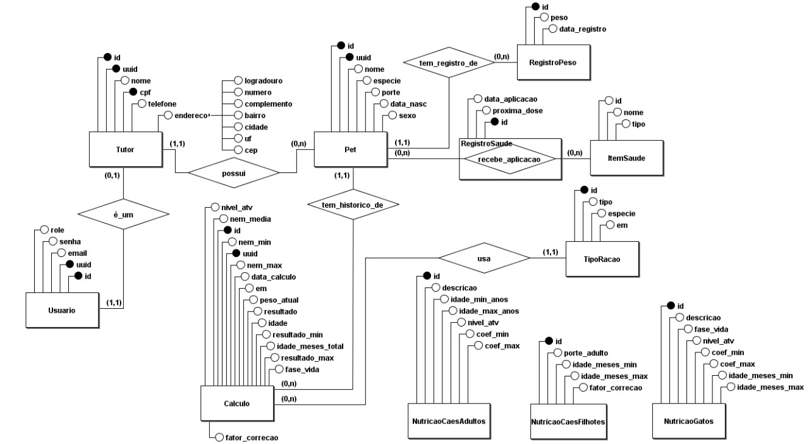

# PetSaude - API de Cálculo de Ração e Gestão de Pets

## 1. Introdução

O projeto PetSaude é uma API RESTful desenvolvida em Java com Spring Boot. O objetivo da API é fornecer *endpoints* para o gerenciamento de tutores e seus animais de estimação, com foco principal em um serviço de cálculo de porção de ração diária, além de funcionalidades de gestão de saúde (vacinas, peso) dos pets.

Este projeto foi desenvolvido para a disciplina de PROGRAMAÇÃO ORIENTADA A OBJETOS PARA WEB II  da UNIVERSIDADE FEDERAL DE SANTA MARIA.

## 2. Tecnologias Utilizadas

* **Java 17**
* **Spring Boot 3**
* **Spring Web:** Para a criação da API REST.
* **Spring Data JPA:** Para persistência de dados.
* **Spring Security:** Para autenticação e autorização via JWT.
* **PostgreSQL:** Banco de dados relacional.
* **Flyway:** Para o versionamento e *migrations* do banco de dados.
* **Springdoc OpenAPI (Swagger):** Para documentação interativa da API.
* **Jakarta Bean Validation:** Para validação de dados de entrada (DTOs).
* **Lombok:** Para redução de código *boilerplate* nas entidades.

## 3. Modelo Entidade-Relacionamento (ER)

(Aqui você deve inserir a imagem do seu Modelo ER quando estiver pronta).



## 4. Instruções de Execução

1.  Clone o repositório Git e acesse a *branch* `primeira_entrega`.
2.  Crie um banco de dados PostgreSQL (ex: `petsaude`).
3.  Configure o arquivo `src/main/resources/application.properties` com a URL, usuário e senha do seu banco.
4.  Rode o projeto (via IDE ou `mvn spring-boot:run`).
5.  O Flyway executará automaticamente as *migrations*, criando toda a estrutura do banco.

## 5. Documentação da API (Swagger)

Toda a API foi documentada seguindo o padrão OpenAPI 3 (Swagger), utilizando anotações `@Operation`, `@ApiResponse` e `@Schema` em todos os *Controllers*, DTOs e Modelos.

A documentação interativa está disponível em:

```http
http://localhost:8080/PetSaude/swagger-ui.html
```

## 6. Testes da API (Insomnia)

Para os testes e validação dos endpoints, foi utilizada a ferramenta Insomnia. Uma coleção completa com os testes de todos os fluxos (cadastro, login, CRUDs, lógica de atualização de senha, etc.) foi criada.

O arquivo de exportação da coleção (insomnia_collection.yml) está disponível na raiz deste repositório.

🔐 Instruções sobre o uso da variável {{token}}

Este ambiente utiliza uma variável chamada {{token}} para autenticação nas requisições.

➡️ Como funciona:
O mesmo token é reutilizado automaticamente em todas as requisições, evitando ter que copiar e colar manualmente no campo Auth toda hora.

➡️ Como trocar o tipo de usuário:
Existem dois tipos de usuários no sistema:

👤 Tutor

🧑‍💼 Admin

Se quiser testar as requisições como outro usuário, basta alterar o valor da variável token nas variáveis de ambiente do Insomnia:

Vá em Manage Environments (Ctrl+E).

Localize a variável "token".

Substitua o valor atual pelo novo token (do usuário tutor ou admin).

Salve as alterações.

Depois disso, todas as requisições usarão automaticamente o novo token. ✅

## 7. Destaques da Implementação (Boas Práticas)

### Segurança com JWT
A API é protegida com Spring Security. A autenticação é feita via POST /login, que retorna um token JWT. Este token é validado a cada requisição pelo AutenticacaoFilter, e as permissões (ADMIN vs USER) são tratadas no SecurityConfig.

### Validação e Tratamento de Erros
A API utiliza Spring Validation (@Valid) em todos os DTOs de entrada. Falhas de validação, autenticação, ou regras de negócio (como emails duplicados) são capturadas globalmente pela classe TratadorDeErros, que retorna respostas JSON padronizadas com códigos HTTP corretos (400, 401, 404, 409).

### Separação de Responsabilidades (DTOs)
O projeto não expõe as Entidades JPA diretamente na API. Foram criados DTOs (Data Transfer Objects) para cada operação (ex: DadosCadastroTutorDTO, DadosAtualizacaoPerfilTutorDTO), garantindo que apenas os dados necessários sejam recebidos ou enviados e permitindo validações específicas.

### Lógica de Atualização Segura
A lógica de atualização de perfil (ex: TutorService.atualizarPerfilCompleto) implementa verificações de segurança, exigindo a senha atual do usuário para permitir a alteração de dados críticos como email ou a própria senha.

### Mapeamento Muitos-para-Muitos (NxN)
O relacionamento entre Pet e ItemSaude (vacinas, remédios) foi implementado como um "NxN" através da entidade associativa RegistroSaude, que armazena dados da relação, como data_aplicacao e proxima_dose.


## 8. Regras de Negócio Principais

Esta seção descreve as regras e lógicas de negócio que governam a aplicação.

### Segurança e Autenticação

* **Acesso Público vs. Privado:** Apenas os endpoints `POST /login` e `POST /tutores/cadastrar` são públicos. Todos os outros endpoints requerem um token JWT de autenticação.
* **Níveis de Permissão:** Existem duas roles: `USER` (Tutor) e `ADMIN`.
* **Permissões de Admin:** Usuários `ADMIN` podem:
    * Criar novos usuários `ADMIN` (`POST /usuarios/admin`).
    * Promover usuários `USER` para `ADMIN` (`PUT /usuarios/tornar-admin/{id}`).
    * Listar todos os pets do sistema (`GET /pets/listar`).
    * Listar todos os itens de saúde (`GET /saude/itens/listar`).

### Gestão de Tutores e Usuários

* **Cadastro Único:** Ao cadastrar um `Tutor` (`POST /tutores/cadastrar`), um `Usuario` associado com a role `USER` é criado em cascata.
* **Dados Únicos:** O `email` (na tabela `usuario`) e o `cpf` (na tabela `tutor`) são validados para serem únicos no sistema.
* **Atualização de Perfil Segura:** Um `Tutor` ou `Admin` pode atualizar seus dados não-críticos (nome, telefone, endereço) livremente. No entanto, para atualizar dados críticos (como `novoEmail` ou `novaSenha`), é **obrigatório** fornecer a `senhaAtual` correta para verificação.

### Gestão de Pets

* **Propriedade:** Todo `Pet` deve estar associado a um `Tutor`.
* **Acesso Restrito:** Um `Tutor` (usuário `USER`) só pode visualizar e gerenciar os seus próprios pets.

### Cálculo de Ração (Core)

* **Entradas Obrigatórias:** Para realizar um cálculo (`POST /calculos/calcular/{petUuid}`), o usuário deve fornecer o `pesoAtual` do pet e seu `nivelAtividade`.
* **Fonte da Ração:** O usuário deve informar a Energia Metabolizável (EM) da ração de uma de duas formas:
    1.  Fornecendo o `idTipoRacao` de uma ração pré-cadastrada no sistema.
    2.  Fornecendo um valor `emManual` (em kcal/kg).
* **Lógica de Cálculo:** O `CalculoService` usa tabelas internas de nutrição (ex: `nutricao_caes_adultos`, `nutricao_gatos`) para encontrar os coeficientes (`coef_min`, `coef_max`) e fatores de correção (`fator_correcao`) com base na espécie, idade, porte e nível de atividade do pet, calculando assim a recomendação diária em gramas.

### Gestão de Saúde

* **Escopo dos Itens:** Os itens de saúde (vacinas, remédios) podem ser de dois tipos:
    1.  **Globais:** Criados por um `ADMIN` (`tutor_id` é `NULL`). Ficam visíveis para todos os usuários.
    2.  **Personalizados:** Criados por um `TUTOR` (`tutor_id` é preenchido). Ficam visíveis apenas para o `ADMIN` e para o `Tutor` que os criou.
* **Histórico (NxN):** A aplicação de um item em um pet é feita pela entidade `RegistroSaude`, que funciona como uma tabela associativa (Muitos-para-Muitos) entre `Pet` e `ItemSaude`, guardando atributos extras como `data_aplicacao` e `proxima_dose`.


